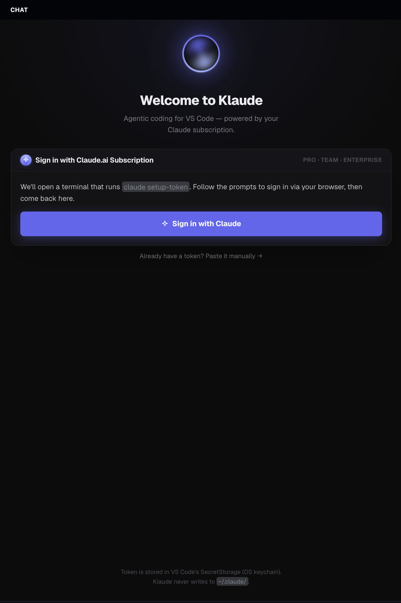
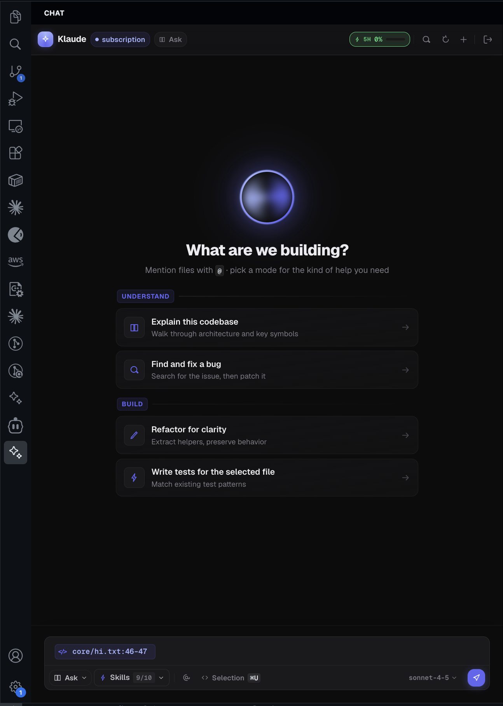
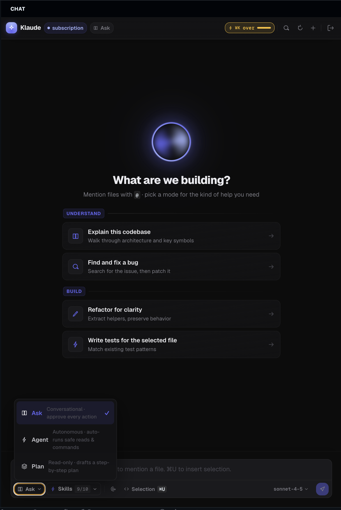
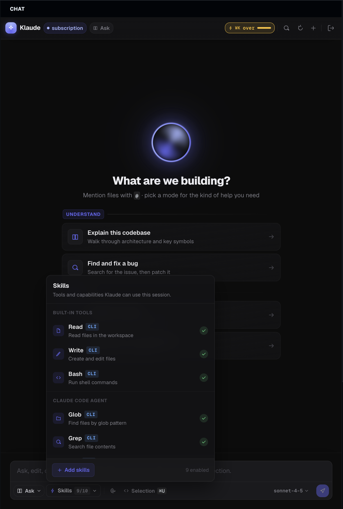
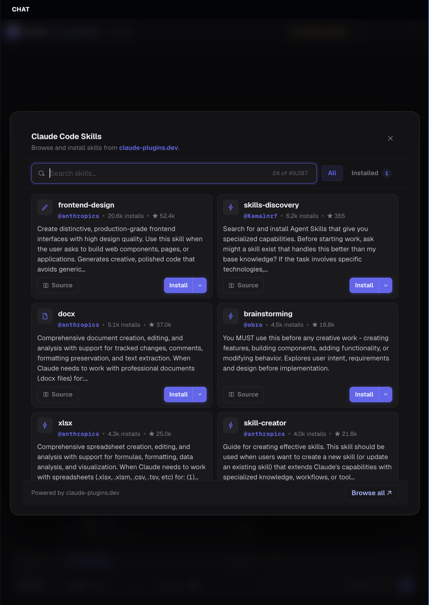
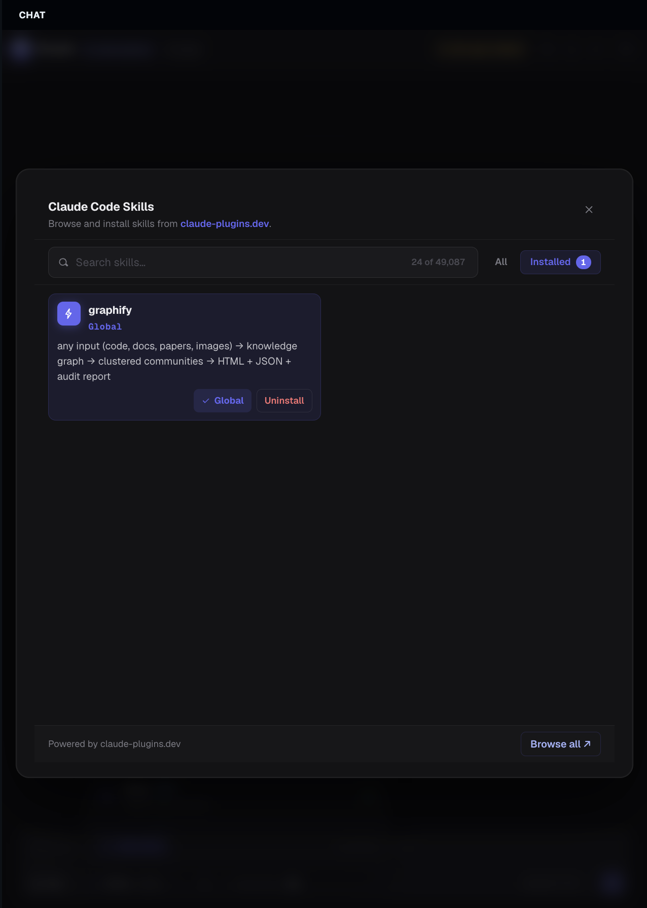
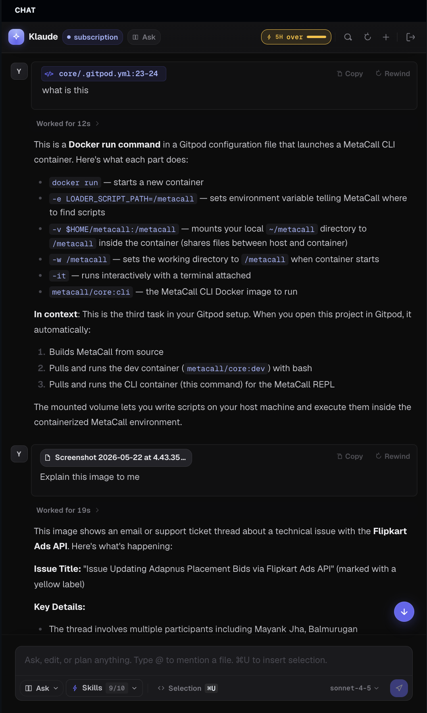
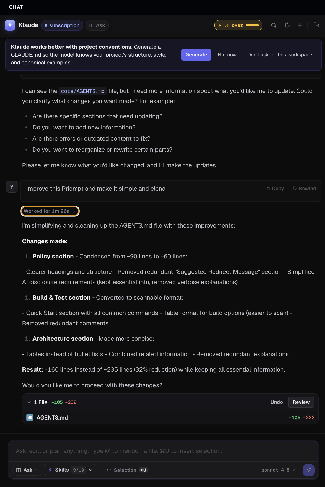

# Klaude

**Agentic AI coding assistant for VS Code — powered by your Claude Code subscription.**

Klaude brings the full Claude Code agent into a native VS Code side panel: streaming chat, multi-file edits with inline diff previews, terminal execution under a permission gate, plan-mode review with inline comments, and the Claude Code Skills marketplace — all driven by your existing **Claude.ai Pro / Team / Enterprise** subscription. No per-tn billing, no separate API key.



---

## Highlights

- 🔐 **Subscription-powered.** Sign in once with `claude setup-token`; credentials live in the OS keychain. No API key file on disk.
- 💬 **Native side-panel chat.** Streaming responses, slash commands, `@`-mention files, Cmd+U to send a selection, Cmd+Shift+I to toggle.
- 🛡️ **Three permission modes.** `Ask` (approve every action), `Agent` (auto-approve read/search, prompt on writes), `Plan` (reason-only — no execution).
- 📝 **Plan-mode review.** Pop the plan into its own editor tab, leave inline comments on individual steps, and ship the revised plan back to the agent in one click.
- 🧠 **Project conventions.** Reads `CLAUDE.md` / `AGENTS.md` automatically; one-click "Generate CLAUDE.md" to bootstrap a new repo.
- 🧩 **Skills marketplace.** Browse and install any skill from [claude-plugins.dev](https://claude-plugins.dev) directly from the panel.
- 🕰 **Checkpoints + rewind.** Every assistant turn snapshots edited files so you can roll back without leaving the chat.
- 📦 **Bundled CLI.** Ships with `@anthropic-ai/claude-code` — no separate install step.

---

## Getting started

### 1. Install

Search **Klaude** in the VS Code marketplace, or install the `.vsix` directly:

```bash
code --install-extension klaude-0.1.0.vsix
```

### 2. Sign in

Open the Klaude side panel (✨ in the activity bar). The welcome screen will run `claude setup-token` in a terminal — follow the prompts to authenticate via the browser, then return to VS Code.


Token storage:

- Anthropic API keys → VS Code **SecretStorage** (OS keychain).
- Claude.ai subscription → Claude Code's own credential store (`~/.claude/.credentials.json` on Linux, Keychain on macOS).

Klaude **never writes to `~/.claude/`** itself — only the bundled CLI does, on your behalf.

### 3. Start a chat

Open any workspace and pick a starter, or just type. `@` mentions a file, drag-drop pastes file paths, screenshots paste as image attachments.



---

## Permission modes

Cycle with **Shift+Tab** (when chat is focused) or the **Klaude: Cycle Permission Mode** command.



| Mode | Behavior |
|---|---|
| **Ask** *(default)* | Every tool call prompts for approval. Best for unfamiliar repos. |
| **Agent** | Read/search tools (`Read`, `Grep`, `Glob`, `LS`) auto-approve. Writes, edits, and bash commands still prompt unless they match `klaude.allowedBashPatterns`. |
| **Plan** | Read-only reasoning. The agent investigates and proposes — no `Edit`, `Write`, or `Bash` will execute. |

Protected paths (`.git`, `.env*`, `.ssh`, shell rc files) always prompt regardless of mode.

---

## Skills

Skills extend the agent with reusable, scoped capabilities. The built-in picker shows everything available in this session — built-ins, Claude Code agent tools, and any project- or user-scoped skills you've installed.



Browse and install from **claude-plugins.dev** without leaving the panel:




Install scope is per-skill:

- **Project** → `.claude/skills/<name>/` (committed with your repo)
- **User** → `~/.claude/skills/<name>/` (available everywhere)

---

## Chat in action



- **`@filename`** inserts a file mention; the contents are sent to the model when relevant.
- **Cmd+U** with a selection sends the highlighted code straight into the composer.
- **Screenshots** paste as image attachments — useful for explaining UI bugs.
- **Slash commands** in the composer trigger built-in workflows or installed skill commands.

---

## Project conventions

Klaude looks for `CLAUDE.md` (or `AGENTS.md`) at your workspace root and injects it into every system prompt. If neither exists, the **Generate** action analyzes your repo and writes one for you.



Edited files appear as a collapsible card under the assistant turn with line-add / line-remove counts and an **Undo** button that restores the pre-turn snapshot.

---

## Commands

| Command | Default keybinding |
|---|---|
| Klaude: New Chat | — |
| Klaude: Toggle Chat Panel | `Cmd/Ctrl+Shift+I` |
| Klaude: Cycle Permission Mode | `Shift+Tab` *(chat focused)* |
| Klaude: Send Selection to Chat | `Cmd/Ctrl+U` *(editor has selection)* |
| Klaude: Comment on Selection | *(editor context menu)* |
| Klaude: Generate CLAUDE.md | — |

---

## Settings

| Setting | Default | Description |
|---|---|---|
| `klaude.model` | `claude-sonnet-4-5` | Model alias (`sonnet`, `opus`, `haiku`, `opusplan`, `default`) or explicit version. |
| `klaude.permissionMode` | `default` | `default` / `plan` / `auto`. |
| `klaude.maxTokens` | `4096` | Max output tokens per assistant turn. Lower → fewer rate-limit hits. |
| `klaude.allowedBashPatterns` | `["^git (status\|diff\|log\|branch)$", "^npm (test\|run test)$"]` | Regex allowlist for auto-approved bash commands in **Agent** mode. |

---

## How it works

```
extension.ts
    │
    ▼
ChatPanelProvider ── postMessage ──▶  React webview (chat / plan UI)
    │
    ▼
Orchestrator (tool-loop FSM)
    ├─ ClaudeCliProvider   (streams from `claude -p --output-format stream-json`)
    ├─ PermissionGate      (mode + allowlist + protected-path rules)
    ├─ CheckpointService   (per-turn snapshots of edited files)
    └─ ConventionsLoader   (CLAUDE.md / AGENTS.md injection)
```

The core (`src/core/*`) imports zero VS Code APIs and is unit-tested in isolation. UI and OS integration live in `src/ui/` and `src/services/`. The webview is a standalone React app under `webview/` that talks to the extension host over `postMessage`.

---

## Development

```bash
npm install
(cd webview && npm install)
npm run build
```

Then **Run → Start Debugging** (F5) — an Extension Development Host launches with Klaude active. Use `npm run watch` to live-rebuild the extension while iterating.

### Tests

```bash
npm test       # vitest, core only — no VS Code APIs touched
npm run lint   # tsc --noEmit
```

### Packaging

```bash
npm run package   # → klaude-0.1.0.vsix
```

---

## Privacy

- Your code is sent to Anthropic only when the agent requests a tool that reads it, or when you `@`-mention or paste it. The webview never autouploads workspace files.
- Tokens live in the OS keychain via VS Code's SecretStorage API. Klaude does not write credentials to disk under any path it controls.
- Permission prompts surface every potentially destructive action (writes, bash, network) before execution.

---

## License

MIT
